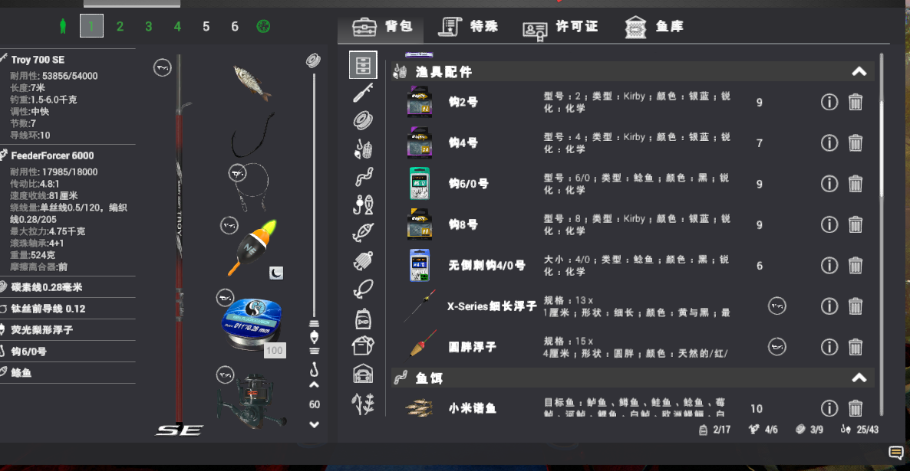
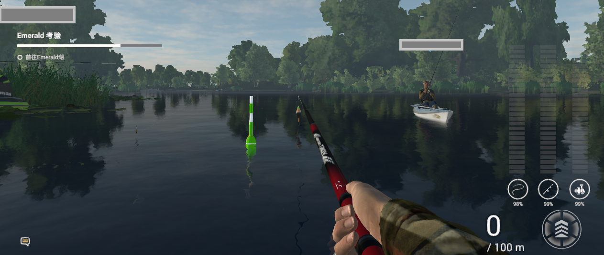

# 钓鱼星球脚本

[English version](documents/English_readme.md)

该项目是一个基于python3的钓鱼星球脚本，意在跳过繁琐的升级过程，尽快升到高级别以解锁渔具，从而获得更好的游戏体验。
仅推荐有python程序基础的玩家使用该项目。

## 依赖的包:
```
PIL
pywin32
opencv-python
numpy
pysimplegui
```

## 程序功能
程序目前提供在Alberta秒提狗鱼/大西洋鲑鱼的功能。

程序目前提供在Michigan渔场秒提白斑狗鱼的功能。


## 程序效率

在Michigan渔场中，平均钓鱼时间为4分20秒，具体钓鱼时间和位置及鱼潮时间有关。

## 如何运行：
1. 进入游戏，调整分辨率为```1280×720```，并关闭全屏幕模式，将指示器调至三列(更宽)，并进入渔场，到达指定的钓鱼位置，并将钓竿调至抛投模式```F11```。若有可能，请尽量调低特效。

2. 将程序下载到本地，打开本地命令行窗口(需要管理员权限)，调整目录至```main.py```所在位置。

3. 关闭所有可能弹窗及可能遮挡住游戏内容的软件，保持游戏在屏幕中央大致居中即可。

4. 使用命令行语句```python main.py```开启程序，并按照程序说明使用即可。

## 程序测试

程序在Alberta指定位置测试无异常。测试时使用的渔具如下：


测试时使用的位置如下：


程序正在Michigan指定位置测试无异常。测试使用的渔具为：



测试使用的位置如下：



## 程序日志

程序日志保留在```log```文件夹中，若项目中无此文件夹，请手动创建。

## 已知问题

1. 在完成成就后程序有可能会无法识别到赠送的物品(缺少样本图像，无法进行识别)。

2. 若焦点被锁定到程序外，程序可能无法对游戏继续做出反应。