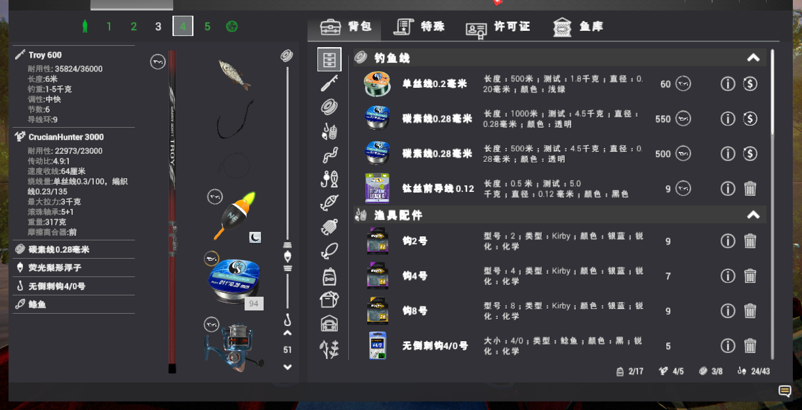
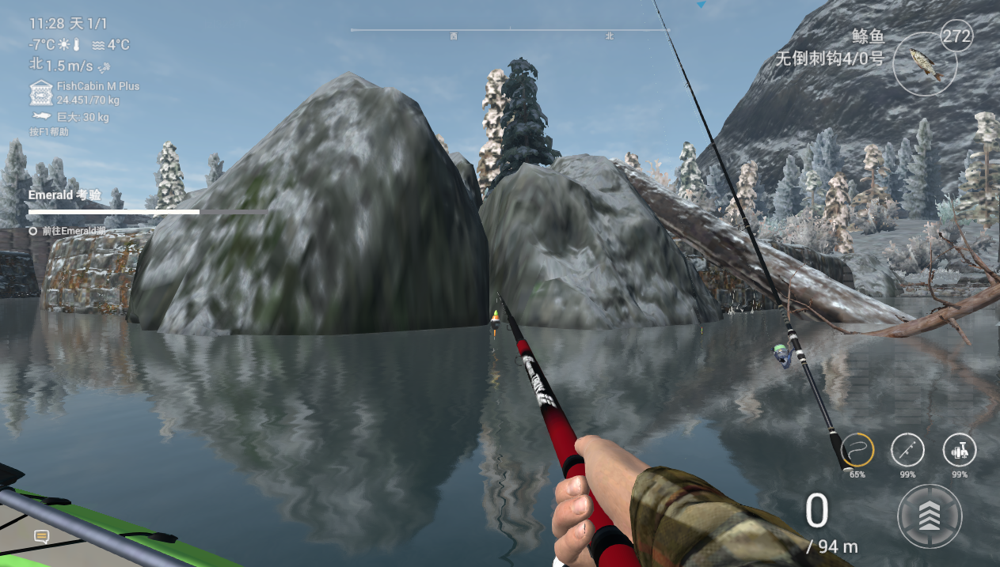

# Fishing planet helper

This project is a script of fishing planet based on python3, and aims to skip the tedious upgrade process and upgrade to a higher level as soon as possible to unlock fishing gear, so as to get a better game experience.

This project is only recommended for players who have a python program foundation.


## Dependence packages:
```
PIL
pywin32
opencv-python
numpy
pysimplegui
```


## Program function

At present, the program only provides the function of raising pike / Atlantic salmon in Alberta.


## How to run:

Enter the game, set the game resolution to ```1280 × 720```, turn off the full screen mode, and adjust the indicator to the three column version to the specified position. If possible, please adjust the effect to the minimum.

Use git clone to program clone to any position, adjust the fishing position after entering the game, adjust the fishing rod to the cast mode, and use the python environment that has already installed the package to call ```main.py```.

Please make sure that the game interface is within the scope of the screen. Please close all possible pop-up software. The screen cannot be locked during the use of the script, and the focus must always be in the game.

## Program testing

The program tested in Alberta designated location for 4 hours without exception. The fishing gear used in the test is as follows:



The positions used in the test are as follows:




## Program log

Program logs are kept in the folder ```log```. If there is no such folder in the project, please create it manually.